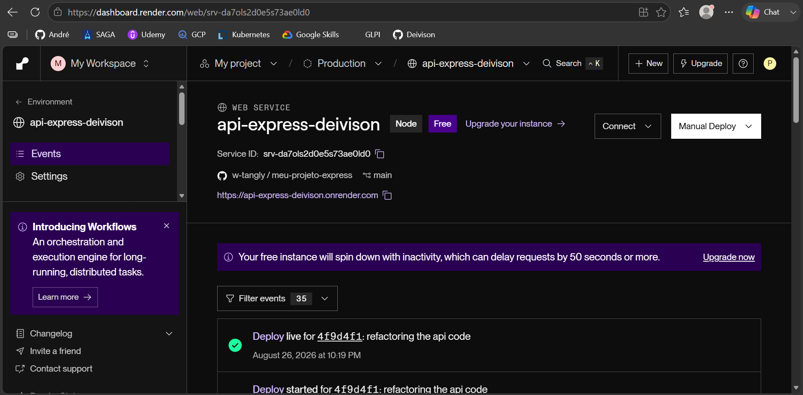
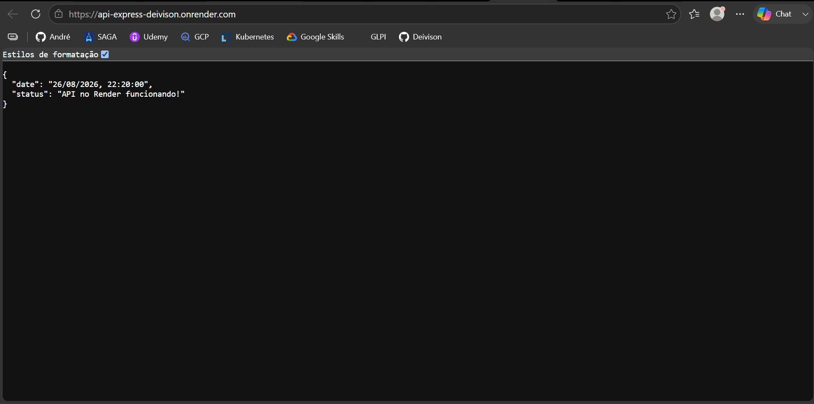
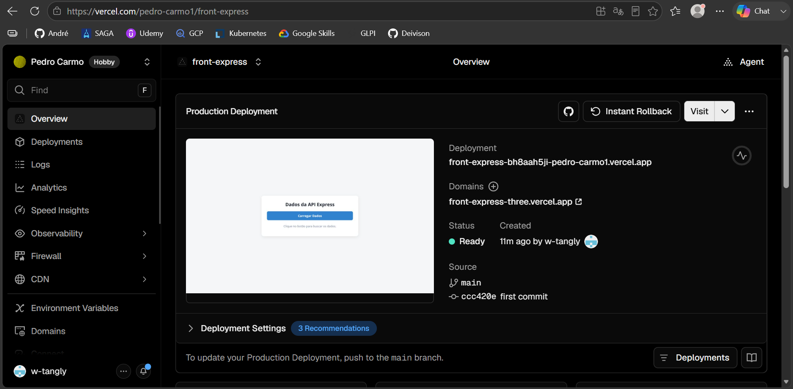
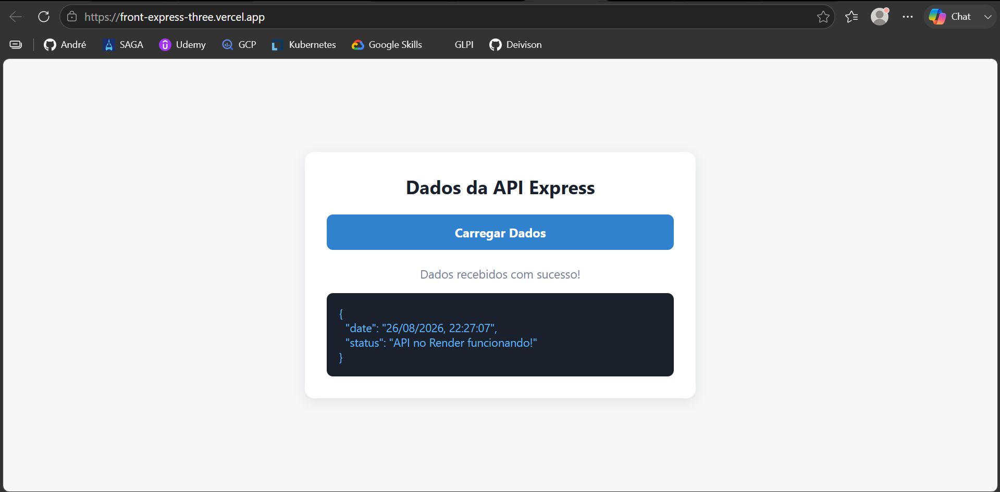

# Documentação da atividade 02 (aula 04 - 26/08)

## API
Após a criação da API usando de JavaScript, subi o código da mesma para o Github e tentei fazer o deploy dele no Render. Nesse momento tive um pequeno problema de funcionamento do endpoint público onde tive que refatorar as dependências do código e adicionar os módulos do Node.js.

Apesar da dificuldade, por fim consegui fazer o deploy do endpoint público como mostrado nas imagens a seguir:

### O código
A princípio tive algumas dificuldades em relação ao deploy do backend no Render, mas isso veio de um pequeno erro pessoal meu dentro do armazenamento em repositório Git no Github, uma vez que subi o projeto sem os módulos do Node e por conta disso o Render não conseguiu reconhecer as dependências e bibliotecas usadas devidamente

## Front-end

Após conseguir fazer o deploy da API devidamente, eu pedi para o [Gemini](https://gemini.google.com/) realizar uma página visual para integrar a API hospedada no Render. O prompt utilizado foi o seguinte:

> "_Crie uma página frontend simples que se alimente do seguinte endpoint: https://api-express-deivison.onrender.com_"

O resultado obtido foi então hospedado na plataforma vercel como mostram os prints a seguir:

