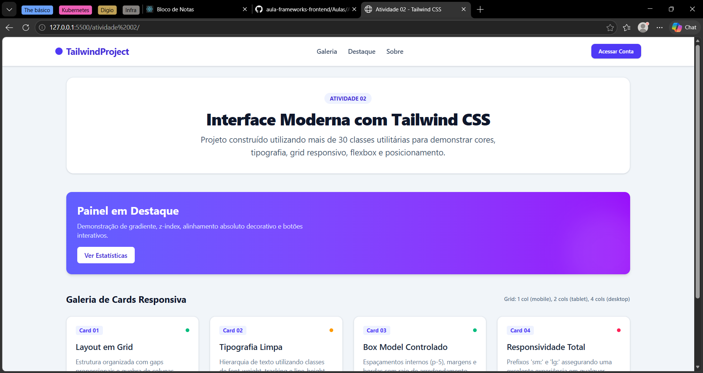
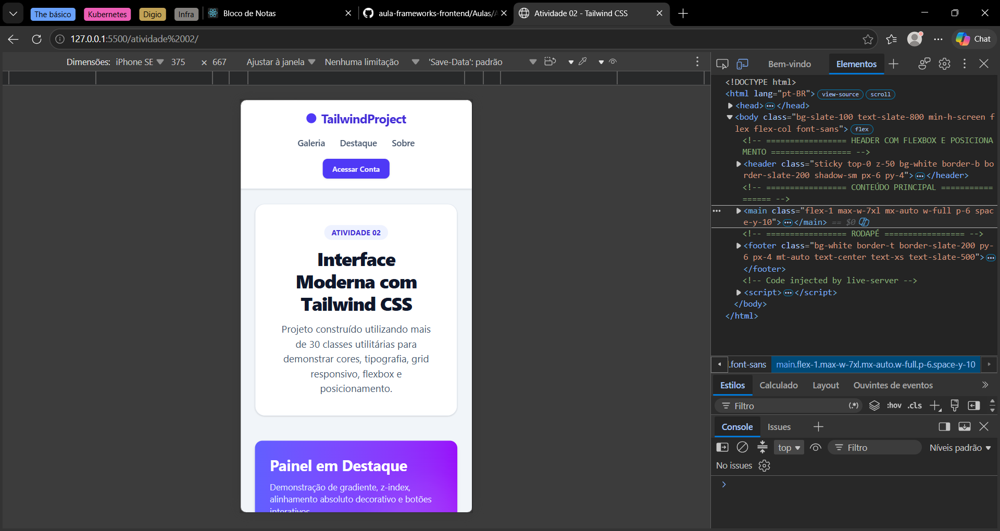
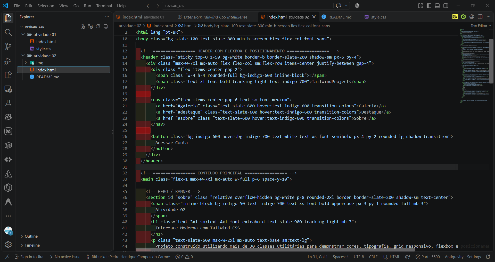

# Atividade 02 - Desenvolvimento com Tailwind CSS

Este projeto consiste na implementação de uma interface moderna e responsiva utilizando **Tailwind CSS**, atendendo a todos os requisitos propostos na Atividade 02.

---

## 🔗 Link do Projeto Desenvolvido
- **Repositório GitHub:** `[COLE_AQUI_O_LINK_DO_SEU_REPOSITORIO]`
- **Deploy / Demonstração Online (se houver, ex: GitHub Pages ou Vercel):** `[COLE_AQUI_O_LINK_DO_DEPLOY]`

---

## 📸 Demonstração do Projeto (Prints)

### 1. Aplicação em Funcionamento

*Figura 1: Visualização do layout em telas Desktop.*


*Figura 2: Visualização responsiva em dispositivos móveis.*

### 2. Prints do Código-Fonte
*(Tire prints do VS Code mostrando a estrutura do HTML com as classes Tailwind)*


*Figura 3: Trecho do código-fonte utilizando as classes utilitárias do Tailwind.*

---

## 📋 Lista das Classes Tailwind CSS Utilizadas

Foram empregadas mais de 30 classes utilitárias, cobrindo todas as categorias exigidas:

| Categoria | Classe | Função / Propriedade CSS Equivalente |
|---|---|---|
| **Cores** | `bg-white` | `background-color: #ffffff;` (Fundo branco) |
| **Cores** | `bg-slate-100` | `background-color: #f1f5f9;` (Fundo cinza suave) |
| **Cores** | `bg-indigo-600` | `background-color: #4f46e5;` (Fundo roxo/índigo) |
| **Cores** | `text-slate-800` | `color: #1e293b;` (Texto escuro suave) |
| **Cores** | `text-white` | `color: #ffffff;` (Texto branco) |
| **Cores** | `hover:bg-indigo-700` | Altera a cor de fundo ao passar o cursor do mouse |
| **Tipografia** | `text-sm` | `font-size: 0.875rem;` (Texto tamanho pequeno) |
| **Tipografia** | `text-xl` | `font-size: 1.25rem;` (Título médio/grande) |
| **Tipografia** | `text-4xl` | `font-size: 2.25rem;` (Título de grande destaque) |
| **Tipografia** | `font-bold` | `font-weight: 700;` (Texto em negrito) |
| **Tipografia** | `tracking-tight` | `letter-spacing: -0.025em;` (Espaçamento estreito entre letras) |
| **Tipografia** | `text-center` | `text-align: center;` (Alinhamento centralizado) |
| **Espaçamentos** | `p-6` | `padding: 1.5rem;` (Preenchimento interno geral) |
| **Espaçamentos** | `px-4` | `padding-left/right: 1rem;` (Padding horizontal) |
| **Espaçamentos** | `py-2` | `padding-top/bottom: 0.5rem;` (Padding vertical) |
| **Espaçamentos** | `mb-3` | `margin-bottom: 0.75rem;` (Margem inferior) |
| **Espaçamentos** | `mx-auto` | `margin-left: auto; margin-right: auto;` (Centraliza blocos) |
| **Espaçamentos** | `space-y-10` | Aplica espaçamento vertical de 2.5rem entre elementos filhos |
| **Dimensões** | `w-full` | `width: 100%;` (Largura máxima/total) |
| **Dimensões** | `min-h-screen` | `min-height: 100vh;` (Altura mínima de 100% da tela) |
| **Dimensões** | `max-w-7xl` | `max-width: 80rem;` (Limita a largura máxima do container) |
| **Bordas** | `border` | `border-width: 1px;` (Borda padrão) |
| **Bordas** | `border-slate-200` | `border-color: #e2e8f0;` (Cor da borda clara) |
| **Bordas** | `rounded-lg` | `border-radius: 0.5rem;` (Cantos arredondados) |
| **Bordas** | `rounded-full` | `border-radius: 9999px;` (Bordas totalmente circulares) |
| **Posicionamento**| `relative` | `position: relative;` (Posicionamento relativo) |
| **Posicionamento**| `absolute` | `position: absolute;` (Posicionamento absoluto) |
| **Posicionamento**| `sticky` | `position: sticky;` (Fixa o elemento com scroll) |
| **Posicionamento**| `top-0` | `top: 0px;` (Alinhamento no topo) |
| **Posicionamento**| `z-50` | `z-index: 50;` (Controle de camada de sobreposição) |
| **Flexbox** | `flex` | `display: flex;` (Habilita container Flexbox) |
| **Flexbox** | `flex-col` | `flex-direction: column;` (Direção dos itens em coluna) |
| **Flexbox** | `items-center` | `align-items: center;` (Alinhamento vertical central) |
| **Flexbox** | `justify-between`| `justify-content: space-between;` (Distribuição com espaçamento entre itens) |
| **Flexbox** | `gap-4` | `gap: 1rem;` (Espaçamento entre itens flex) |
| **Grid** | `grid` | `display: grid;` (Habilita container Grid) |
| **Grid** | `grid-cols-1` | `grid-template-columns: repeat(1, minmax(0, 1fr));` (1 coluna no mobile) |
| **Grid** | `gap-6` | `gap: 1.5rem;` (Espaçamento entre as células do grid) |
| **Responsividade**| `sm:flex-row` | Em telas `>= 640px`, altera a direção flex para linha |
| **Responsividade**| `sm:grid-cols-2`| Em telas `>= 640px`, divide o grid em 2 colunas |
| **Responsividade**| `lg:grid-cols-4`| Em telas `>= 1024px`, divide o grid em 4 colunas |

---

## 🚀 Como Executar o Projeto

1. Clone o repositório ou baixe os arquivos para o seu computador:
   ```bash
   git clone https://github.com/seu-usuario/revisao_css.git